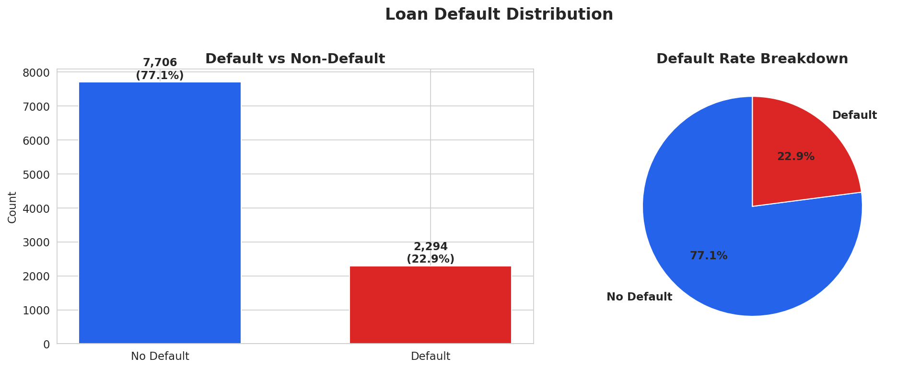
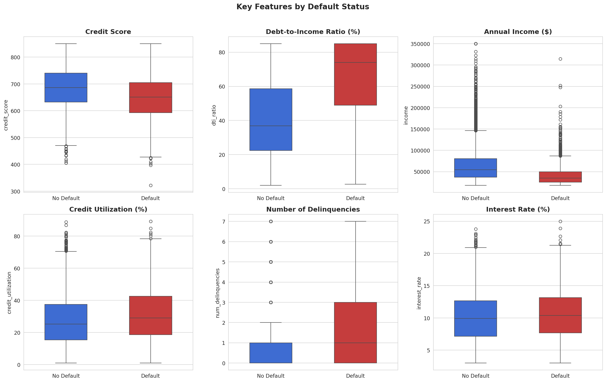
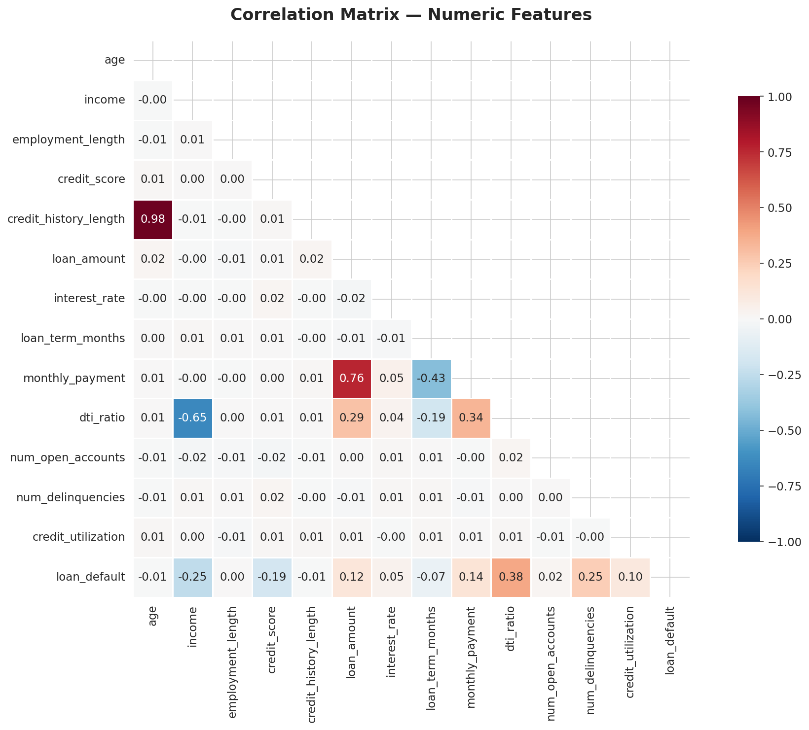
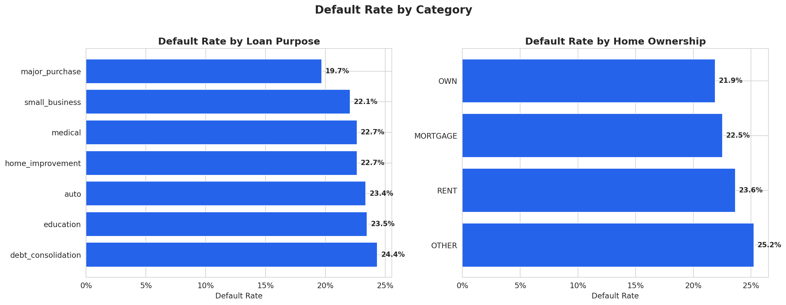
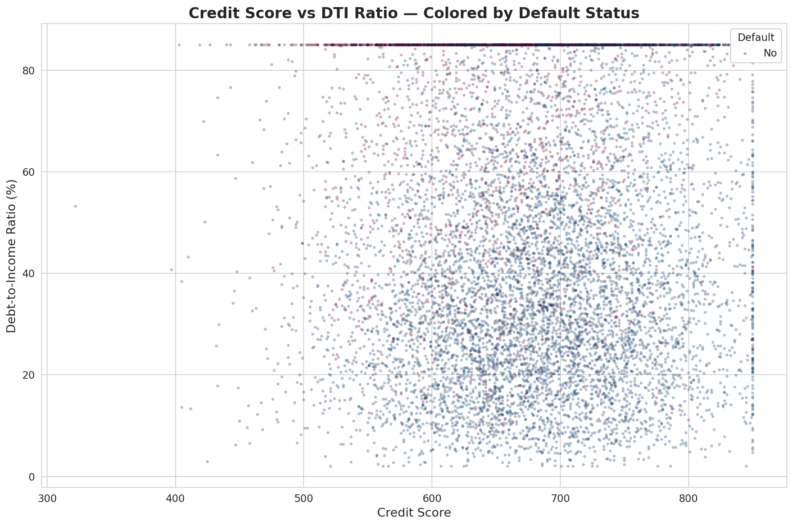
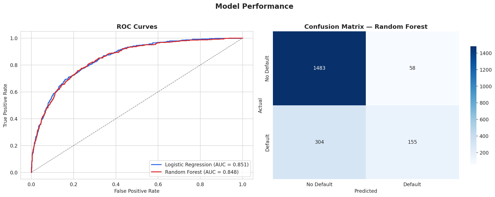
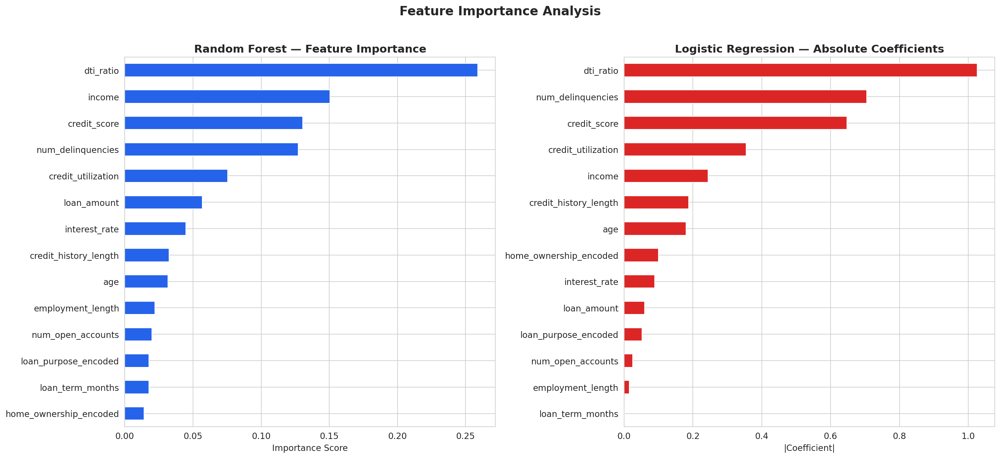

# Credit Risk Scoring & Feature Analysis

A complete exploratory data analysis and classification project that identifies the strongest predictors of loan default — built from the perspective of someone with a decade of banking experience.

## Project Overview

Loan defaults cost financial institutions billions annually. This project analyzes 10,000 loan applications to uncover the key risk factors that predict default, then builds classification models to flag high-risk borrowers before approval.

**Why this matters in banking:** As someone who has spent 10 years on the client-facing side of banking, I've seen firsthand how defaults impact both the institution and the borrower. This project bridges that domain knowledge with data science to answer the question every credit committee asks: *which applicants are most likely to default, and what signals should we watch for?*

## Key Findings

| Metric | Value |
|--------|-------|
| Dataset Size | 10,000 loan applications |
| Default Rate | 22.9% |
| Best Model AUC | 0.85 (Logistic Regression) |
| Top Predictor | Debt-to-Income Ratio |

### Top 5 Default Predictors
1. **Debt-to-Income Ratio** — the single strongest signal (importance: 0.259)
2. **Annual Income** — lower income borrowers default at higher rates
3. **Credit Score** — borrowers under 600 default at 37.2% vs 13.3% for 750+
4. **Number of Delinquencies** — any prior delinquency nearly doubles default risk (30.7% vs 16.5%)
5. **Credit Utilization** — high utilization signals financial stress

### Segment Analysis
| Segment | Default Rate |
|---------|-------------|
| Low credit score (<600) | 37.2% |
| High credit score (>750) | 13.3% |
| High DTI (>50%) | 39.9% |
| Low DTI (<20%) | 5.6% |
| Has delinquencies | 30.7% |
| No delinquencies | 16.5% |

## Visualizations

### Target Distribution


### Feature Distributions by Default Status


### Correlation Matrix


### Default Rates by Category


### Credit Score vs DTI — Risk Landscape


### Model Performance


### Feature Importance


## Methodology

### Data
Synthetic dataset of 10,000 loan applications with 15 features simulating credit bureau data. Features include demographics (age, income, employment length), credit history (score, utilization, delinquencies), and loan details (amount, rate, term, purpose).

### Exploratory Data Analysis
- Distribution analysis of all numeric and categorical features
- Correlation analysis to identify multicollinearity
- Segmented default rate analysis by key risk factors
- Scatter plots to visualize interaction between features

### Models
| Model | ROC-AUC | F1 (Default Class) |
|-------|---------|-------------------|
| Logistic Regression | 0.851 | 0.511 |
| Random Forest | 0.848 | 0.461 |

Both models were evaluated with 5-fold cross-validation. Logistic Regression slightly outperformed Random Forest, which is common with well-structured tabular data and moderate feature counts.

### Tools Used
- **Python** — core language
- **Pandas** — data manipulation and analysis
- **Scikit-learn** — preprocessing, model training, evaluation
- **Matplotlib & Seaborn** — all visualizations
- **NumPy** — numerical operations

## How to Run

```bash
# Clone the repo
git clone https://github.com/yourusername/credit-risk-analysis.git
cd credit-risk-analysis

# Install dependencies
pip install pandas numpy scikit-learn matplotlib seaborn

# Run the full analysis
python credit_risk_analysis.py
```

All figures will be saved to the `figures/` directory.

## Project Structure

```
credit-risk-analysis/
├── README.md
├── credit_risk_analysis.py    # Full analysis script
├── credit_risk_data.csv       # Generated dataset (10K rows)
└── figures/
    ├── fig1_target_distribution.png
    ├── fig2_features_by_default.png
    ├── fig3_correlation_heatmap.png
    ├── fig4_categorical_defaults.png
    ├── fig5_scatter_score_dti.png
    ├── fig6_model_performance.png
    └── fig7_feature_importance.png
```

## Business Recommendations

Based on this analysis, a lending institution should:

1. **Flag applications with DTI > 50%** for additional review — these have a 40% default rate
2. **Weight credit score heavily** but not exclusively — it's the 3rd strongest predictor, not the 1st
3. **Treat any prior delinquency as a major risk signal** — it nearly doubles default probability
4. **Consider income-adjusted thresholds** rather than fixed cutoffs, since DTI captures risk better than income alone
5. **Combine automated scoring with human review** for borderline cases — the model's 85% AUC means it catches most risk, but 15% of the signal lives in context a model can't see

## Author

Shequita.S— M.S. Data Science candidate | 10 years in banking & finance

[Portfolio](https://yoursite.com) · [LinkedIn](www.linkedin.com/in/shequita-s-42aab7349) · [Email](stevenson.shequita@gmail.com)
